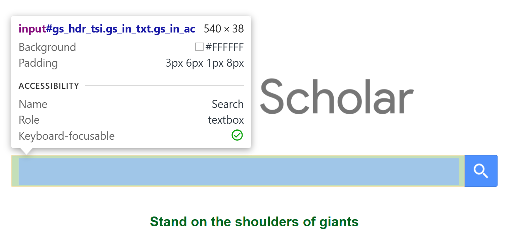
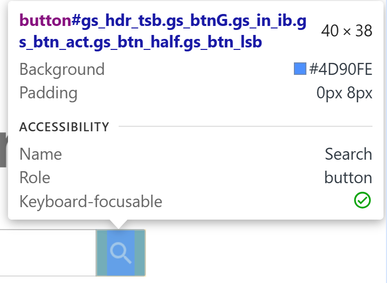
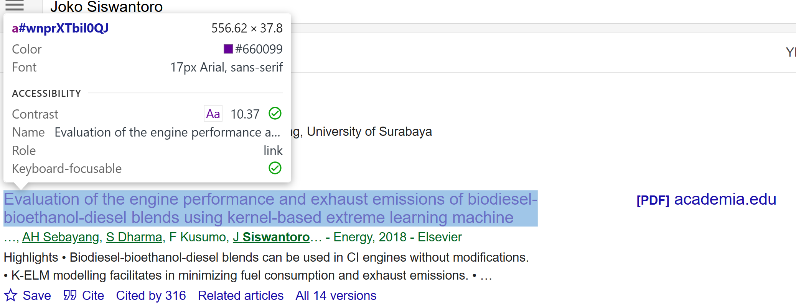
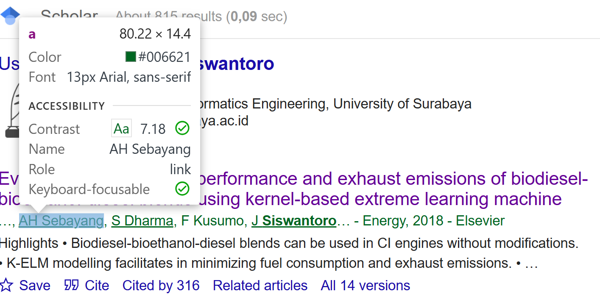
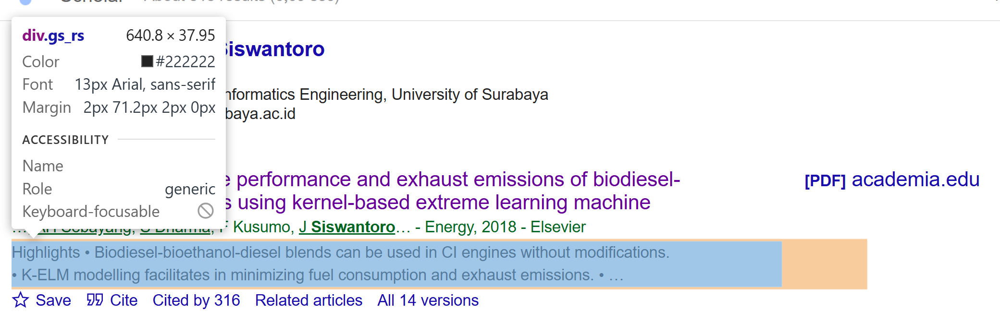

# Evaluating Google Scholar’s Web Page

Before scraping or automating data retrieval from Google Scholar, it is necessary to analyze the structure of the web pages involved.
This document explains the evaluation process for the **home page**, the **result page**, and the **query URL structure** used by Google Scholar.


## 1. Evaluating the Home Page

The Google Scholar home page provides a basic search interface.
By inspecting its HTML, we can identify how user input is submitted to the search endpoint.

### HTML Structure

```html
<form id="gs_hdr_frm" action="/scholar">
    <input type="hidden" name="hl" value="en">
    <input type="hidden" name="as_sdt" value="0,5">

    <div class="gs_in_txtw gs_in_txtb gs_in_acw" data-duid="100">
        <input type="text" class="gs_in_txt gs_in_ac" name="q"
            id="gs_hdr_tsi" size="50" maxlength="2048"
            autocapitalize="off" autocomplete="off"
            aria-label="Search" dir="ltr">
    </div>

    <button type="submit" id="gs_hdr_tsb" name="btnG"
        aria-label="Search"
        class="gs_btnG gs_in_ib gs_btn_act gs_btn_half gs_btn_lsb">
        <span class="gs_wr"><span class="gs_ico"></span><span class="gs_lbl"></span></span>
    </button>
</form>
```

### Element Analysis

| Element                                        | Description           | Function                                                       |
| ---------------------------------------------- | --------------------- | -------------------------------------------------------------- |
| `<form id="gs_hdr_frm" action="/scholar">`     | Search form container | Defines the HTTP request target when submitting a search query |
| `<input type="text" name="q" id="gs_hdr_tsi">` | Search input field    | Captures the user’s search keyword(s)                          |
| `<button type="submit" id="gs_hdr_tsb">`       | Submit button         | Sends the search request to the `/scholar` endpoint            |

### Visual Reference

| Component      | Screenshot                   |
| -------------- | ---------------------------- |
| Search textbox |  |
| Submit button  |      |

This structure shows that the query term is submitted via an HTTP **GET** request to `/scholar`, with the search keyword passed as a query parameter named `q`.


## 2. Evaluating the Result Page

When a search is performed, Google Scholar returns a result page that retains the same header form for subsequent searches.
The relevant portion of the form remains identical, with the `value` attribute of the text input now populated by the current query.

### Example Search Input Form (from the results page)

```html
<form id="gs_hdr_frm" action="/scholar">
    <input type="hidden" name="hl" value="en">
    <input type="hidden" name="as_sdt" value="0,5">
    <div class="gs_in_txtw gs_in_txtb gs_in_acw">
        <input type="text" class="gs_in_txt gs_in_ac" name="q"
            value="Joko Siswantoro" id="gs_hdr_tsi"
            size="50" maxlength="2048"
            autocapitalize="off" autocomplete="off"
            aria-label="Search" dir="ltr">
    </div>
    <button type="submit" id="gs_hdr_tsb" name="btnG"></button>
</form>
```

This confirms that the same form structure persists across pages, ensuring consistent input handling.


## 3. Evaluating the Query URL Structure

When a user submits a search from the Google Scholar home page, the browser sends a GET request to a URL of the following format:

```
https://scholar.google.com/scholar?hl=en&as_sdt=0%2C5&q=Joko+Siswantoro+Image&btnG=
```

### URL Parameter Breakdown

| Parameter | Description                      | Example                 |
| --------- | -------------------------------- | ----------------------- |
| `hl`      | Interface language               | `en` (English)          |
| `as_sdt`  | Dataset selector / search mode   | `0,5`                   |
| `q`       | Query term (search keyword)      | `Joko+Siswantoro+Image` |
| `btnG`    | Search button trigger (optional) | —                       |

The `q` parameter represents the user’s search input.
Google Scholar encodes **whitespace as a plus sign (`+`)** between words.
Thus, the search query `"Joko Siswantoro Image"` becomes:

```
q=Joko+Siswantoro+Image
```

This observation allows a scraper to dynamically construct search URLs programmatically.
For example, given a Python variable `keyword`, a valid query URL can be generated as:

```python
from urllib.parse import quote_plus

base_url = "https://scholar.google.com/scholar"
query = quote_plus("Joko Siswantoro Image")
url = f"{base_url}?hl=en&as_sdt=0%2C5&q={query}&btnG="
```


## 4. Evaluating Search Results Structure

Each individual search result on the page is contained within a `<div>` element with the class `gs_r gs_or gs_scl`.
This div serves as the main container for article information such as title, author, journal source, and metadata.

### Example Result Element

```html
<div class="gs_r gs_or gs_scl" data-cid="wnprXTbil0QJ">
    <div class="gs_ri">
        <h3 class="gs_rt">
            <a href="https://www.sciencedirect.com/science/article/pii/S0360544218312672">
                Evaluation of the engine performance and exhaust emissions of biodiesel-bioethanol-diesel blends using kernel-based extreme learning machine
            </a>
        </h3>
        <div class="gs_a">
            …, <a href="/citations?user=5hA72L4AAAAJ">AH Sebayang</a>, 
            <a href="/citations?user=aexhi0oAAAAJ">J <b>Siswantoro</b></a> – Energy, 2018 – Elsevier
        </div>
        <div class="gs_rs">
            Highlights • Biodiesel-bioethanol-diesel blends can be used in CI engines without modifications. • K-ELM modelling facilitates minimizing fuel consumption and exhaust emissions.
        </div>
        <div class="gs_fl gs_flb">
            <a href="/scholar?cites=4942667839185844930">Cited by 316</a>
            <a href="/scholar?q=related:wnprXTbil0QJ">Related articles</a>
            <a href="/scholar?cluster=4942667839185844930">All 14 versions</a>
        </div>
    </div>
</div>
```


### Structural Summary

| HTML Element                      | Class               | Description                                                               |
| --------------------------------- | ------------------- | ------------------------------------------------------------------------- |
| `<div class="gs_r gs_or gs_scl">` | Result container    | Encapsulates a single search result entry                                 |
| `<h3 class="gs_rt">`              | Result title        | Contains the article title and the external link                          |
| `<div class="gs_a">`              | Author information  | Lists author names, publication year, and source                          |
| `<div class="gs_rs">`             | Abstract or snippet | Provides a short summary of the article content                           |
| `<div class="gs_fl">`             | Footer metadata     | Contains links such as “Cited by”, “Related articles”, and “All versions” |

### Visual Reference

| Component              | Screenshot                           |
| ---------------------- | ------------------------------------ |
| Result title           |          |
| Author information     |       |
| Description / abstract |  |

## 5. Key Extraction Guidelines

Using the evaluated structure, a scraper can extract relevant data points with reliable selectors:

| Data               | Selector                       | Example                                                  |
| ------------------ | ------------------------------ | -------------------------------------------------------- |
| Title              | `h3.gs_rt a`                   | `"Evaluation of the engine performance..."`              |
| Authors and source | `div.gs_a`                     | `"A. Sebayang, J. Siswantoro – Energy, 2018 – Elsevier"` |
| Description        | `div.gs_rs`                    | `"Highlights • Biodiesel-bioethanol..."`                 |
| Citations          | `div.gs_fl a[href*='cites']`   | `"Cited by 316"`                                         |
| Related articles   | `div.gs_fl a[href*='related']` | `"Related articles"`                                     |


## 6. Summary

Through this evaluation, the following key findings are established:

1. The **query parameter `q`** controls search keywords, with spaces encoded as `+`.
2. Each **search result** follows a consistent DOM structure, allowing predictable parsing.
3. The **result container** (`div.gs_r.gs_or.gs_scl`) holds all relevant information, including title, author, and citation data.
4. The **URL pattern** and form structure remain stable across both the home and results pages, facilitating automated search URL construction.

This evaluation provides a foundation for developing a robust, maintainable scraper that can reliably interact with Google Scholar’s interface.
